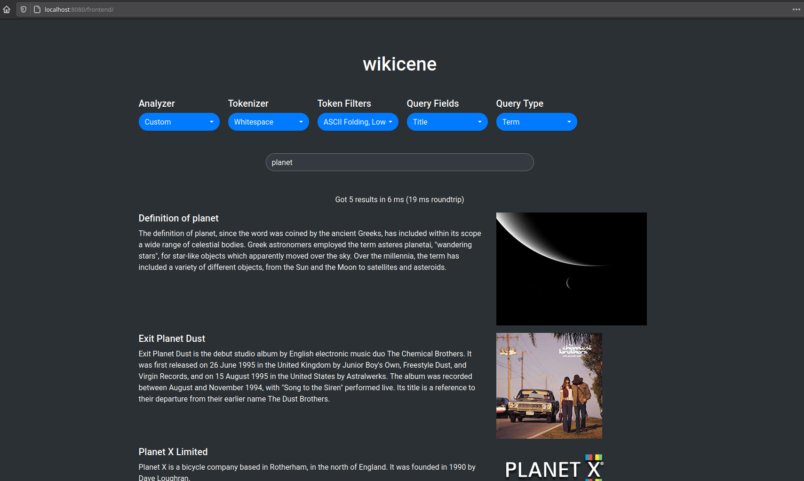

# Wikicene

Wikicene is a demo project I created while investigating the [Apache Lucene](https://lucene.apache.org/) search library.
It is a web application that provides the ability to search through a dump of Wikipedia articles.
Its goal is to showcase some of Lucene's features (e.g. different analyzers and query types) in an attractive form.



## Run it

Before starting the main Wikicene application, you need to generate a dump of Wikipedia articles.
To do that, simply run the python script:

```shell script
$ python3 wikirandom.py
```

This will begin downloading a random Wikipedia article from
[this endpoint](https://en.wikipedia.org/api/rest_v1/page/random/summary) each couple of seconds and putting it into
a `random-articles.dump` text file (this is the file Wikicene will read on start-up).
You can stop the script with `CTRL+C`.
The download cadence can be increased, but we want to avoid spamming such a generous endpoint.

After you have your desired amount of articles in the dump (Wikicene can handle tens of thousands easily), you can start
Wikicene with:

```shell script
$ ./gradlew clean build run
```

Note that the first time you run it, Wikicene will index all the articles in the dump several times, once per supported
analyzer. A normal application would only use one analyzer when indexing, but this is a demo designed to showcase the
search behavior with different analyzers. For around 25k articles, expect a first-run time of about 1 or 2 minutes
before you can interact with the application, as well as about 0.5 GB of disk usage.

Then you can interact with Wikicene in one of two ways. First, you can make requests via a REST-like API by accessing
the endpoint:

```
localhost:8080/?term=planet
```

This endpoint will return a JSON response with the results.

However, you'll likely want to interact with Wikicene using its humble frontend, available at:

```
localhost:8080/frontend/
``` 

## Software/frameworks used

- Python3
- Java 8
- Gradle
- [Vert.x](https://vertx.io/)
- [Apache Lucene](https://lucene.apache.org/)
- [Bootstrap](https://getbootstrap.com/)
- [bootstrap-select](https://github.com/snapappointments/bootstrap-select)
- [Brython](https://brython.info/)

If you believe I lack any mention or attribution, feel free to contact me.
